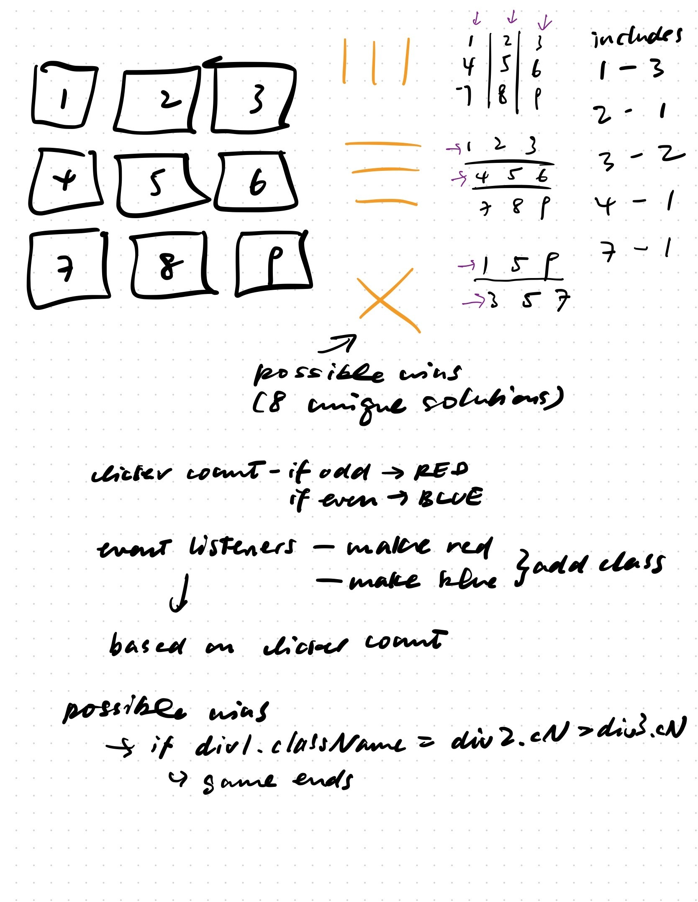

# Tic-tac-toe Project

## Overview
For my first project, I created a game of Tic Tac Toe.

The rules of the game are fiarly self-explanatory. 2 players place a tile on the game board in alternating order. The game ends if one of the players have three in a row, or if all nine squares on the board have been filled. The winning player scores 1 point. If there is a tie, the tie count will increase by 1. The game allows players to play multiple games and reset the score.

You can play the game at https://chanwanvincy.github.io/tic-tac-toe/

## Planning & Problem Solving
- I listed out all the possible scenarios for a player winning
- The notes are a mix of `var` and `function`s that would be helpful in the coding process
- In early iterations there were also pseudocode to aid my mapping

## Technologies used
- Languages - HTML5, CSS3, Javascript
- Design - Google Fonts, [Canva](https://www.canva.com/) assets

## Extra Features
- Scoreboard
- New Game Button
- Reset Button

## Design

I wanted to build not only a functional game but also one that is pleasing to look at. The palette of the game was pulled from the image above of a Japanese gilded screen I found on [this site](https://smithhonig.com/blogs/blog/color-palettes-inspired-by-japan-japanese-color-palettes). 

Instead of using the traditional noughts and exes, I opted for a patterned circle and a flower symbol asset from Canva so the visual language is cohesive.

## Future Development
- Condense the code so it's more precise
- Make it responsive
- Changing colors of winning squares
- Start the turn based on who lost the last round